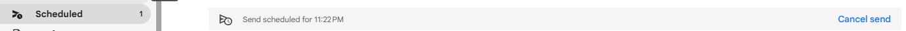

# How to schedule an email in Gmail
## Overview
This guide details out the steps that you need to follow to schedule an email to be sent out at a later time using Gmail.

## Assumptions 
You already have a Gmail account.

## Instructions
Gmail allows you to compose an email and schedule it to be sent at a later time. Follow the instructions below to schedule an email:
1. Click on **Compose** button in the top left corner to start drafting an email.
2. Draft the email as you would normally do by filling in the body of the email, the recipients email addresses in the **To** field, and also in **Cc** and **Bcc** fields if necessary.
3. Click on the arrow seen on the **Send** button 
4. Click on **Schedule send** prompt that appears which will pop a window as shown below:
   
5. Choose any of the options in the list shown or click on **Pick date & time** to choose a date and time other than the listed ones, and click on **Schedule send**.
   
   
6. If needed, you can cancel the scheduling by going to the **Scheduled** tab in the left pane and clicking on **Cancel send** as shown below.
   

.
